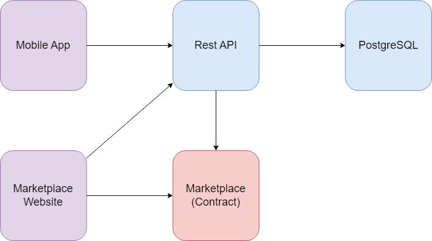

# [Healthcare Wallet](https://github.com/Healthcare-Wallet/wallet/tree/main) / [Wiki](https://github.com/Healthcare-Wallet/wallet/tree/main/wiki) / System Overview

The Healthcare Wallet system consists of several seperate projects that make up the larger system. The best way to understand the purpose of each piece is to understand how data flows through the system.

## System Diagram

## Producer

Data is introduced to our system through the mobile application. All information that patients upload is fed directly to our REST API. All business logic and operations are conducted in the server, while the mobile app is purely a user interface.

## Management

Our REST API is responsible for managing all patient information, and supports CRUD operations on all data models. It is the sole entity capable of communicating with our database directly.

Some information is also stored in IPFS (Interplanetary File Service) for use when NFT's are minted in the future. The data stored here is the entire patient model minus PII (Personally Identifiable Information).

## Production

When new or updated patient information is available, our Marketplace Contract is used to produce new vouchers and eventually NFT's. While this functionality is defined within the contract, it is implemented by other services when said functionality is needed; New information is ready to be made into a product, or an available product has been purchased.

## Consumer

Products that are available are displayed on the Marketplace Website, where they can be purchased by customers. The Marketplace Website is the part of our system which consumes data, thus ending the flow of data through our system.
